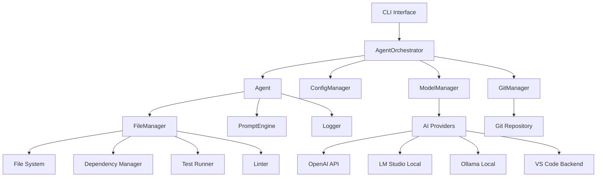
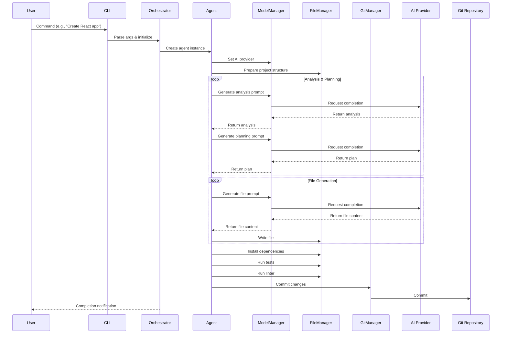

# Agent Project Builder - System Architecture

## Component Overview

## Data Flow

## Component Responsibilities

### CLI Interface
- Parses command line arguments
- Shows help/version information
- Routes requests to AgentOrchestrator

### AgentOrchestrator
- Initializes all managers
- Creates appropriate Agent instances
- Coordinates the request processing workflow
- Handles initialization and cleanup

### Agent
- Maintains agent-specific configuration
- Processes user requests through analysis/planning/execution
- Coordinates with ModelManager, FileManager, and GitManager
- Implements the core agent logic

### ModelManager
- Manages connections to AI providers
- Supports OpenAI, LM Studio, Ollama, and VS Code backends
- Handles local-only mode enforcement
- Provides fallback to mock client for development
- Manages AI completion generation

### ConfigManager
- Loads and manages agent configurations
- Loads and manages model configurations
- Provides default configurations when specific ones aren't found
- Handles JSON configuration files

### FileManager
- Creates project directory structures
- Writes, reads, and edits files
- Installs npm dependencies
- Runs tests and linters
- Handles all file system operations

### GitManager
- Initializes Git repositories if needed
- Commits changes with appropriate messages
- Handles branch management
- Provides push-to-remote functionality

### PromptEngine
- Generates analysis prompts for understanding user requests
- Creates planning prompts for project structure planning
- Generates file-specific prompts for code generation
- Designed to minimize AI hallucination

### Logger
- Provides consistent logging across all components
- Supports different log levels (info, warn, error, debug)
- Includes component-specific prefixes

## AI Provider Integration

### OpenAI Provider
- Uses OpenAI's GPT models via API
- Requires API key from environment variables
- Configuration via OPENAI_API_KEY, OPENAI_MODEL, etc.

### LM Studio Provider
- Connects to locally running LM Studio instance
- No API key required
- Configuration via LMSTUDIO_ENDPOINT, LMSTUDIO_MODEL
- Default endpoint: http://localhost:1234/v1

### Ollama Provider
- Connects to locally running Ollama service
- No API key required
- Configuration via OLLAMA_ENDPOINT, OLLAMA_MODEL
- Default endpoint: http://localhost:11434/v1

### VS Code Agent Provider
- Specialized agent for VS Code integration
- Uses either LM Studio or Ollama backend
- Configured for 100% local operation
- Includes VS Code-specific capabilities

## Local-Only Mode
When LOCAL_ONLY=true is set:
- Forces use of local model providers (LM Studio/Ollama)
- Prevents accidental external API calls
- Uses mock clients as fallback when local providers unavailable
- Ensures complete offline operation

## Error Handling & Fallbacks
- All AI provider initializations have fallback to mock client
- Mock clients provide predictable responses for development
- File operations include proper error handling
- Git operations continue even if individual steps fail
- Logging captures all errors for debugging

## Extensibility Points
1. **New AI Providers**: Add initialization method in ModelManager
2. **New Agent Types**: Create configuration file in config/agents/
3. **New Capabilities**: Add to agent configuration capabilities array
4. **New Tools**: Implement in FileManager and register in agent config
5. **New Prompt Types**: Add methods to PromptEngine
6. **New File Types**: Handle in FileManager.writeFile/readMethod
